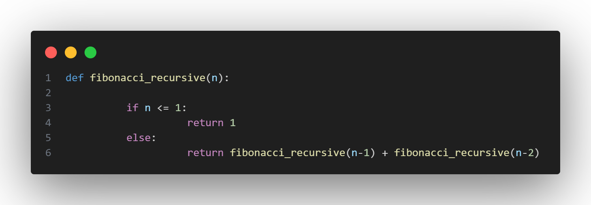
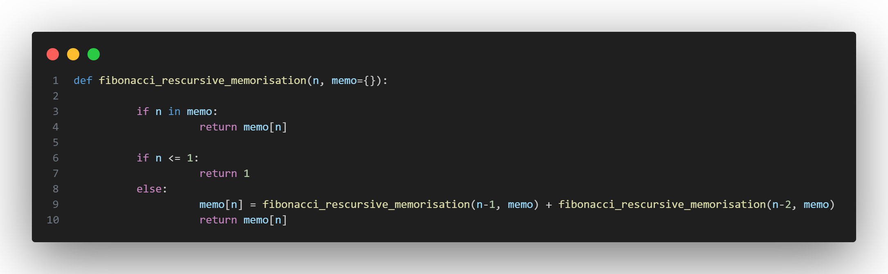
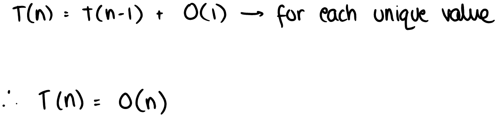
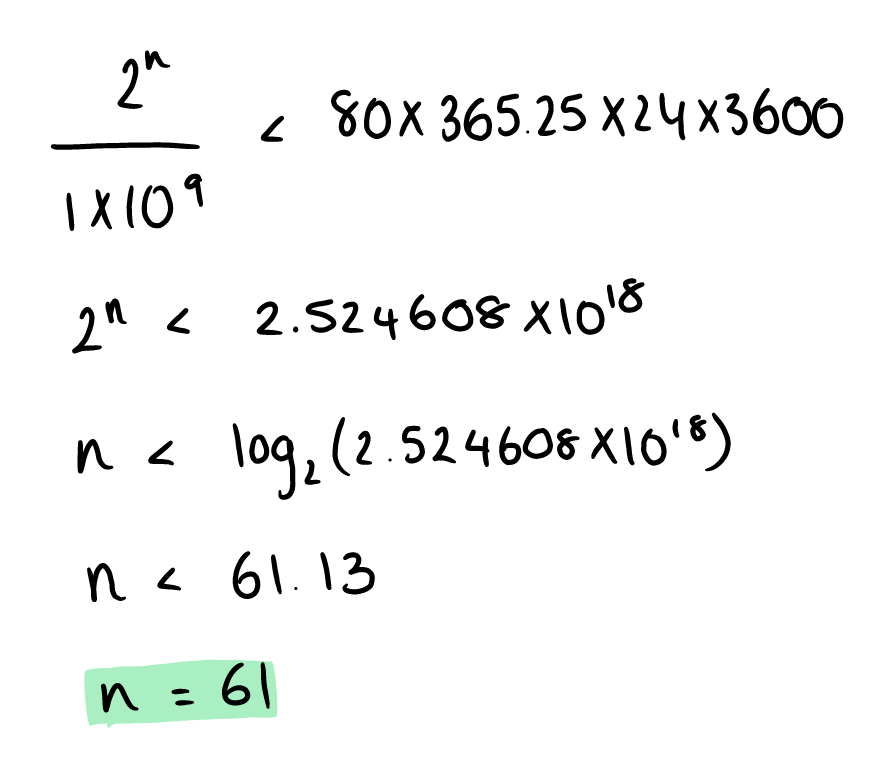
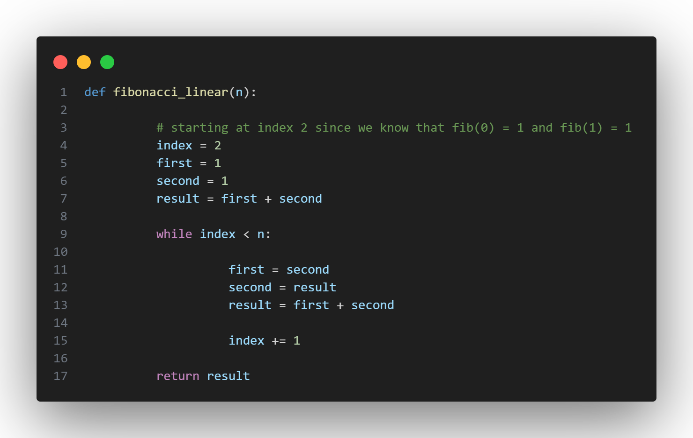
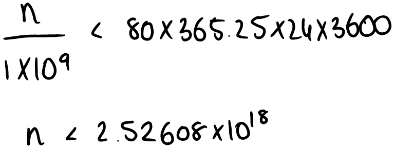

# Fibonacci: From O($2^n$) to O($log(n)$)

## Recursive

Recursion is the process of a function calling itself, creating a ladder of functions that seek to reach the base case and then return values all the way up back to the original parent function.

Thus, since we know that the pattern for the Fibonacci sequence is as follows:

.png)

We can simply formulate the following function:

This is known as a **top-down** approach to solving this problem. 

Instinctively, when I learnt about recursion for the first time, I wrongly assumed that it would always be the most optimal solution for any problem - given its elegant result. And so I fell for that temptation once again when attempting to come up with a solution to this problem. Jumping to my first thought doesn't always work!

So, I analysed the algorithm:

Though the code appears to be simple, it actually has an exponential time complexity! Meaning that fibonacci_recursive(100) will perform 2^100 operations before reaching completion. At 1 billion operations a second, that would still take 4×10^13 years to finish - longer than the age of the universe.

Clearly, recursion is not the way forward.

## RECURSION + MEMORISATION

When we compute Fibonacci recursively, we do as follows:

.png)

However, in the tree we can see that we repeat many of the calculations:

.png)

So I thought, why not create a dictionary that can store the numbers that have already been calculated, and rather than continuing down that branch, it simply returns at that point.

The code is as follows:

This is a much better improvement in terms of time complexity:

This is a crazy improvement! The theoretical max (if you have enough patience to wait 80 years for the program to run) for my first recursive algorithm is as follows:

The maximum possible index we could sensibly calculate is 61.

Whereas for the second algorithm, it can technically go exponentially higher. in fact, python lets us go all the way to 999, however, when I try 1000, I encounter a new problem with my recursive method... **stack overflow**.

When a program is written in python, variables and functions are allocated to a stack of memory addresses - the working stack. However, the stack isn't infinite, and since Python has no stack overflow protection, deep recursions can eventually exceed the capacity of the stack and cause the program to crash - which we don't want.

So, I trashed the recursion idea completely and thought of something else.

## LINEAR

I initially approached the Fibonacci sequence with a **top-down** solution - using the Fibonacci relationship:

.png)

...to work from $n$ and go backwards.

However, knowing the sequence of the Fibonacci numbers, and knowing the input is the index at which we have to stop in the sequence, why not just work from the bottom-up? My idea was that this would entirely remove the need to recursively call the function. In fact, this solution might be even simpler, since it is just a basic loop! Something that I had overlooked initially, thinking "*surely a loop wont work, it is too simple*".

And so, my linear approach is as follows:

Now, although it is slightly longer than my previous recursive attempt, it is of the same time complexity.

It also has no problem going past 999 now - **woohoo**! And no stack overflow errors

Python lets us go all the way to 20576, before throwing an "*exceeds the limit*" error. So lets calculate the actual theoretical limit:

In an average lifetime, we can now calculate the ${2.5\times10^{18}}^{th}$ number in the Fibonacci sequence which is quite an improvement from 61 at the start.

## EVEN FASTER - LOGORITHMIC

Up until now, I have been constantly trying to use the Fibonacci pattern to determine the next number - working out $F_{n-1}$ and $F_{n-2}$ to find $F_n$. But what if there was a way to find some general formula for the $n^{th}$ term of the sequence?

And so, I took a deep dive into linear algebra. Namely: 

- Eigenvalues and eigenvectors
- Matrices
- Dynamic linear models 

Firstly, we begin with the Fibonacci sequence:

.png)

Then we form another equation that we know is true with respect to the Fibonacci sequence:

.png)

Then we write these linear equations in matrix notation:

.png)

Given the dynamic linear relationship:

.png)

We then solve for the eigenvalues:

.png)

Now we find the corresponding eigenvectors:

.png)

Rationalising this, we get:

.png)

Remembering the dynamic linear model equation we derived, we write as follows:

.png)

And so we end up with the following general equation:

.png)

And thus, we have an equation that we can plug k-2 into, to find the kth term!

However, though it is a formula that we are substituting into, it is not O(1) - because we are doing lots of matrix exponentiation. Via different methods (fast exponentiation or fast doubling) we can get the formula to be 100% accurate in O(log(n)) time.

And so, in a lifetime we can calculate the following number of nth terms:

.png)

With the final method, we can calculate $2^{2.5\times10^{18}}$ number in the Fibonacci sequence.

I think that is where I will stop :)

### REFERENCES:

Check out Andrew Chamberlain's explaination of the O($log(n)$) solution:

https://medium.com/@andrew.chamberlain/the-linear-algebra-view-of-the-fibonacci-sequence-4e81f78935a3
